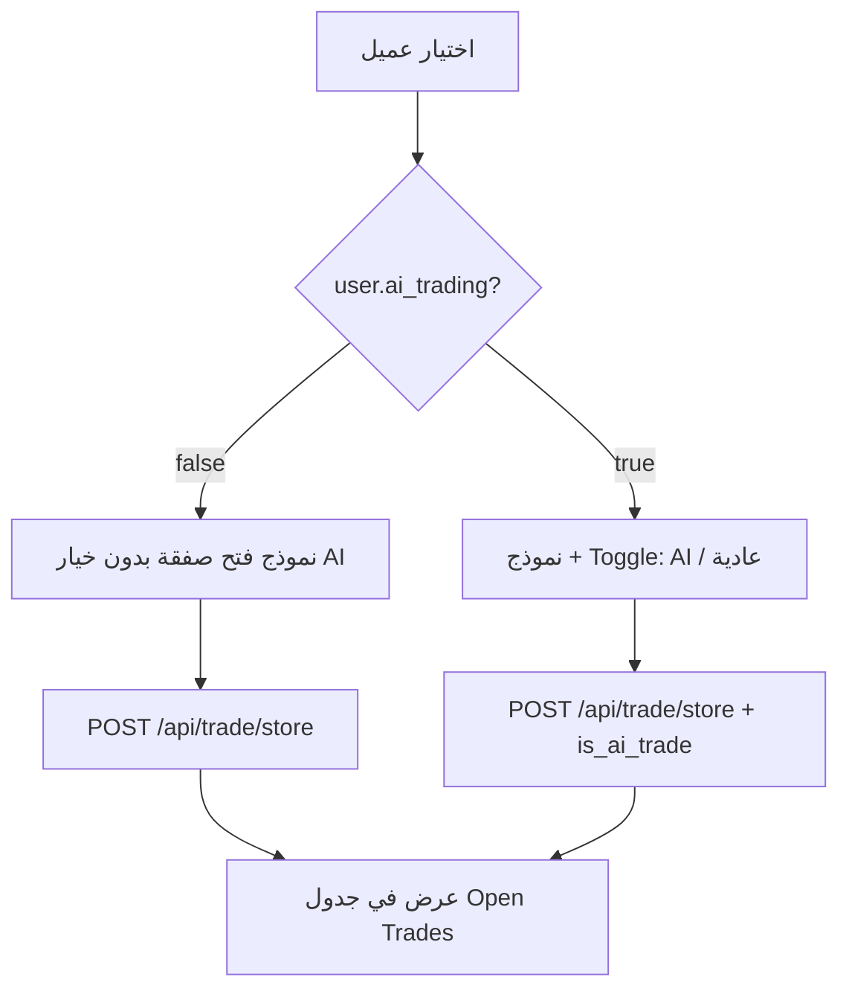

# AI Trading — Admin Open Trade (Frontend Integration)

> **الغرض:** عند فتح صفقة من لوحة الأدمن لمستخدم مفعّل عنده **AI Trading**، يظهر خيار يحدد هل الصفقة **AI** أم **عادية**.  
> **Base URL:** `https://backend.pdxterminal.app/api`  
> **Auth:** Bearer token — `auth:api` (Admin CRM)

---

## 1. ملخص سريع

| المفهوم | الحقل | النوع | ملاحظة |
|---------|--------|------|--------|
| هل المستخدم يدعم AI؟ | `ai_trading` | `boolean` | من بيانات المستخدم (قائمة / تفاصيل) |
| هل الصفقة مفتوحة كـ AI؟ | `is_ai_trade` | `boolean` | يُرسل عند **فتح** الصفقة فقط |
| عرض في الجداول | `is_ai_trade` | `boolean` | في قائمة الصفقات المفتوحة والمغلقة |

---

## 2. بيانات المستخدم — `ai_trading`

يُرجع الحقل في موارد المستخدمين (مثال: قائمة العملاء):

```json
{
  "id": 123,
  "email": "user@example.com",
  "allow_trade": true,
  "ai_trading": true
}
```

| `ai_trading` | واجهة فتح الصفقة |
|--------------|------------------|
| `false` | **لا** تعرض toggle AI — لا ترسل `is_ai_trade: true` |
| `true` | اعرض خيار: **صفقة AI** / **صفقة عادية** (افتراضي: عادية) |

**مصادر الـ API (موجودة مسبقاً):**
- `UsersResource` — قائمة users في الأدمن
- `UserResource` (CRM) — تفاصيل مستخدم

> تفعيل/إيقاف AI للمستخدم يتم من **تطبيق المستخدم** (`PUT` profile — ليس جزءاً من هذا المستند). الأدمن يقرأ `ai_trading` فقط ليعرف إن كان الخيار يظهر.

---

## 3. فتح صفقة من الأدمن

### Endpoint

```
POST /api/trade/store
```

**Middleware:** `auth:api`, `AdminVerified`, `blockedAdmin`, `check.time`

### Request Body

| الحقل | مطلوب | النوع | الوصف |
|--------|--------|------|--------|
| `user_id` | ✅ | `string` | معرف العميل |
| `symbol` | ✅ | `string` | رمز الأصل (مثل `EURUSD`) |
| `direction` | ✅ | `string` | `buy` \| `sell` |
| `opening_price` | ✅ | `number` | سعر الفتح |
| `lot` | ✅ | `number` | اللوت |
| `amount` | ✅ | `number` | المبلغ |
| `spread` | ✅ | `number` | السبريد |
| `leverage` | ✅ | `integer` | الرافعة |
| `stop_loss` | ❌ | `number` (≥ 0) | حد الخسارة بالمبلغ — `0` = بدون SL |
| `take_profit` | ❌ | `number` (≥ 0) | هدف الربح بالمبلغ — `0` = بدون TP |
| **`is_ai_trade`** | ❌ | `boolean` | **جديد** — صفقة AI أم عادية |

### أمثلة

**مستخدم بدون AI (`ai_trading: false`):**

```json
{
  "user_id": "123",
  "symbol": "EURUSD",
  "direction": "buy",
  "opening_price": 1.085,
  "lot": 0.1,
  "amount": 1000,
  "spread": 0,
  "leverage": 100
}
```

لا حاجة لإرسال `is_ai_trade` — تُسجَّل الصفقة كـ `is_ai_trade: false`.

---

**مستخدم مع AI (`ai_trading: true`) — صفقة عادية:**

```json
{
  "user_id": "123",
  "symbol": "EURUSD",
  "direction": "sell",
  "opening_price": 1.084,
  "lot": 0.1,
  "amount": 1000,
  "spread": 0,
  "leverage": 100,
  "is_ai_trade": false
}
```

---

**مستخدم مع AI — صفقة AI:**

```json
{
  "user_id": "123",
  "symbol": "EURUSD",
  "direction": "buy",
  "opening_price": 1.085,
  "lot": 0.1,
  "amount": 1000,
  "spread": 0,
  "leverage": 100,
  "is_ai_trade": true
}
```

### Response (نجاح)

نفس شكل الـ API الحالي (`sendApiResonse`). كائن الصفقة (Position) يتضمن:

```json
{
  "status": true,
  "message": "...",
  "data": {
    "id": 456,
    "user_id": 123,
    "symbol": "EURUSD",
    "direction": "buy",
    "is_ai_trade": true,
    "...": "..."
  }
}
```

### أخطاء

| الحالة | HTTP | الرسالة |
|--------|------|---------|
| `is_ai_trade: true` والمستخدم `ai_trading: false` | `422` | `AI trading is not enabled for this user.` |
| حقول مطلوبة ناقصة | `422` | أخطاء validation الاعتيادية |

مثال خطأ:

```json
{
  "message": "AI trading is not enabled for this user.",
  "errors": {
    "is_ai_trade": [
      "AI trading is not enabled for this user."
    ]
  }
}
```

---

## 4. قواعد العمل (Business Rules)

```
IF user.ai_trading === false:
  - لا تعرض UI لاختيار AI
  - لا ترسل is_ai_trade: true (يرفض الـ backend)

IF user.ai_trading === true:
  - اعرض Toggle / Radio:
      [ ] صفقة عادية  → is_ai_trade: false (أو عدم الإرسال = false)
      [ ] صفقة AI     → is_ai_trade: true
  - الافتراضي: صفقة عادية (false)
```

> **ملاحظة:** `is_ai_trade` **لا يُحدَّث** بعد فتح الصفقة عبر `POST /api/trade/update/{id}` — القيمة ثابتة عند الإنشاء فقط.

---

## 5. عرض الصفقات في الجداول

### الصفقات المفتوحة

```
POST /api/trade/index/open
```

### الصفقات المغلقة

```
POST /api/trade/index/close
```

الاستجابة: `PositionResource` collection — كل عنصر يحتوي:

```json
{
  "id": 456,
  "user_id": 123,
  "email": "user@example.com",
  "symbol": "EURUSD",
  "direction": "buy",
  "is_ai_trade": true,
  "profit": 12.5,
  "open_at": "2026-06-03 10:00:00",
  "close_at": null
}
```

### اقتراح UI للجدول

| عمود / Badge | الشرط |
|--------------|--------|
| Badge `AI` | `is_ai_trade === true` |
| Badge `Manual` أو بدون | `is_ai_trade === false` |
| فلتر (اختياري) | All / AI only / Manual only |

---

## 6. Flow مقترح (شاشة فتح صفقة)



---

## 7. TypeScript (مرجع سريع)

```typescript
interface UserListItem {
  id: number;
  ai_trading: boolean;
  allow_trade: boolean;
  // ...
}

interface OpenTradeRequest {
  user_id: string;
  symbol: string;
  direction: 'buy' | 'sell';
  opening_price: number;
  lot: number;
  amount: number;
  spread: number;
  leverage: number;
  stop_loss?: boolean;
  take_profit?: boolean;
  stop_loss_price?: number;
  take_profit_price?: number;
  is_ai_trade?: boolean; // only when user.ai_trading === true
}

interface Position {
  id: number;
  user_id: number;
  is_ai_trade: boolean;
  // ...
}
```

---

## 8. Migration (Backend / DevOps)

على السيرفر يجب تشغيل:

```bash
php artisan migrate --path=database/migrations/2026_06_03_000008_add_is_ai_trade_to_positions_table.php
```

بدونها قد يفشل `POST /api/trade/store` إذا العمود `is_ai_trade` غير موجود في `positions`.

---

## 9. خارج النطاق (حالياً)

- تطبيق المستخدم عند فتح صفقة بنفسه **لا** يرسل `is_ai_trade` من الأدمن — سلوك منفصل إن طُلب لاحقاً.
- لا يوجد endpoint أدمن لتفعيل `ai_trading` للعميل في هذا التحديث (يُدار من profile المستخدم).

---

## 10. ملاحظة Backend (JSON boolean)

الفرونت يرسل `is_ai_trade: true` كـ JSON boolean — صحيح.  
لا تستخدم `$request->boolean()` على السيرفر لهذا الحقل (كان يحوّل `true` إلى `false`).  
الإصلاح: `TradeService::parseRequestBoolean()`.

---

## 11. Checklist للفرونت

- [ ] قراءة `ai_trading` من بيانات العميل قبل فتح نموذج الصفقة
- [ ] إظهار Toggle فقط إذا `ai_trading === true`
- [ ] إرسال `is_ai_trade` في `POST /api/trade/store`
- [ ] عرض badge `AI` في جداول open/close حسب `is_ai_trade`
- [ ] معالجة 422 عند إرسال `is_ai_trade: true` لمستخدم غير مفعّل
- [ ] التأكد من تشغيل migration على السيرفر

---

**آخر تحديث:** 2026-06-03  
**ملفات Backend ذات الصلة:**  
`app/Http/Controllers/admin/Trading/IndexController.php`  
`app/Services/TradeService.php`  
`app/Http/Resources/PositionResource.php`  
`database/migrations/2026_06_03_000008_add_is_ai_trade_to_positions_table.php`
