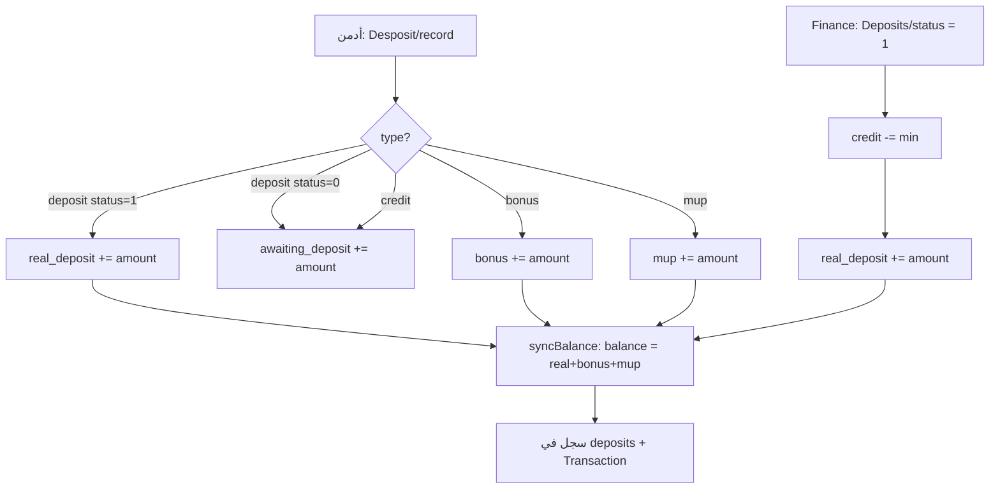

# توثيق نظام المحافظ والإيداعات والتعديل (Admin)

**المشروع:** user-bbs-backend · Laravel 8  
**التاريخ:** يونيو 2026  
**الجمهور:** فريق الأدمن / الفرونت / الباكند

---

## 1. نظرة عامة

تم إعادة هيكلة محافظ العميل بحيث:

- كل مبلغ يُخزَّن في **محفظة محددة** (Real Deposit، Credit، Bonus، MUP).
- حقل **`balance`** في `info_trade_users` = **مجموع المحافظ الثلاثة القابلة للتداول** (وليس الإيداع الحقيقي وحده).
- الأدمن يضيف أو يعدّل كل محفظة على حدة، و**`balance` يتحدّث تلقائياً**.
- عمود **`fake`** لم يعد مستخدماً — يُستبدل بـ **`mup`** ويُحذف من DB بالـ migration.

المنطق المركزي: `App\Services\Users\UserWalletService`

---

## 2. هيكل قاعدة البيانات

### جدول `info_trade_users`

| العمود | النوع | الوصف |
|--------|------|--------|
| `real_deposit` | decimal | **الإيداع الحقيقي فقط** (محفظة Real / Deposit) |
| `bonus` | string/decimal | البونص |
| `mup` | decimal | MUP (بديل `fake`) |
| `balance` | string | **المجموع** = `real_deposit + bonus + mup` (مزامنة تلقائية) |
| `awaiting_deposit` | — | **Credit** — منفصل، لا يدخل في `balance` |
| `money` | — | محفظة Actual (تحويلات داخلية بين money و balance) |

### معادلة الرصيد

```
main_balance = real_deposit + bonus + mup
balance      = main_balance   (يُحفظ في العمود balance)
```

**Credit** (`awaiting_deposit`): يظهر في `total_all_wallets = main_balance + credit` لكن **لا يُستخدم في فحص رصيد التداول** حتى يُوافق عليه الإيداع.

### خصم من الرصيد (`applyDebit`)

أي سحب / تحويل من trading / خسارة صفقة / موافقة withdraw — إذا `main_balance >= المبلغ`:

1. `real_deposit` → 2. `mup` → 3. `bonus`  
ثم `syncBalance()`.

إضافة للرصيد الرئيسي: `applyCreditToMain()` (تزيد `real_deposit`).

### جدول `deposits` (سجل العمليات)

كل عملية إضافة من الأدمن تُسجَّل سطراً في `deposits` مع:

| حقل | مثال |
|-----|------|
| `user_id` | 82157 |
| `amount` | 15 |
| `type` | `deposit` \| `credit` \| `bonus` \| `mup` |
| `status` | `0` معلّق · `1` معتمد |
| `message` | ملاحظة الأدمن |

**عرض API:** القيم القديمة `fake` تظهر كـ `mup` (Accessor في `Deposit` model).

---

## 3. أنواع المحافظ (للطلبات)

| `type` في الطلب | التسمية | أين يُخزَّن؟ | يدخل `balance`؟ |
|-----------------|---------|--------------|-----------------|
| `deposit` + `status=1` | إيداع معتمد | `real_deposit` | نعم (عبر المجموع) |
| `deposit` + `status=0` | إيداع معلّق | `awaiting_deposit` فقط | لا |
| `credit` | كريديت | `awaiting_deposit` | لا |
| `bonus` | بونص | `bonus` | نعم |
| `mup` | MUP | `mup` | نعم |

**غير مسموح** على `Desposit/record`: `withdrawal`, `withdraw`

### أسماء قديمة (Aliases) — تُقبل في الطلب وتُحوَّل داخلياً

| قديم | جديد |
|------|------|
| `fake` | `mup` |
| `awaiting_deposit`, `awaiting` | `credit` |
| `bouns` | `bonus` |
| `real`, `real_deposit` | `deposit` |

---

## 4. الـ API — المصادقة

كل المسارات التالية تحت:

- `Authorization: Bearer {admin_jwt}`
- Middleware: `auth:api`, `AdminVerified`, `blockedAdmin`
- Prefix عام: `/api`

---

## 5. إضافة مبلغ (محفظة + سجل إيداع)

### `POST /api/user/Desposit/record`

**صلاحيات:** `Add-Balance` أو `Edit-Balance` (مع bypass للأدمن الرئيسي في `RolePermission`)

**Body:**

```json
{
  "id": 82157,
  "amount": 100,
  "type": "deposit",
  "status": 1,
  "note": "إيداع يدوي"
}
```

| حقل | مطلوب | قواعد |
|-----|--------|-------|
| `id` | نعم | `exists:users,id` |
| `amount` | نعم | `numeric`, `gt:0` |
| `type` | نعم | ضمن `allowedTypes()` |
| `status` | لا | `0` أو `1` — افتراضي `1` |
| `note` | لا | نص |

### أمثلة حسب النوع

**إيداع حقيقي معتمد:**
```json
{ "id": 82157, "amount": 100, "type": "deposit", "status": 1 }
```
→ `real_deposit += 100` → `balance` يُعاد حسابه.

**إيداع معلّق (كريديت فقط):**
```json
{ "id": 82157, "amount": 50, "type": "deposit", "status": 0 }
```
→ `awaiting_deposit += 50` — **`balance` لا يتغير**.

**MUP:**
```json
{ "id": 82157, "amount": 15, "type": "mup", "status": 1 }
```

**بونص:**
```json
{ "id": 82157, "amount": 30, "type": "bonus" }
```

**كريديت مباشر:**
```json
{ "id": 82157, "amount": 25, "type": "credit" }
```

### Response ناجح (202)

```json
{
  "message": "Deposit wallet updated successfully",
  "status": 202,
  "data": {
    "wallets": {
      "real_deposit": 100,
      "credit": 0,
      "bonus": 0,
      "mup": 15,
      "main_balance": 115,
      "balance": 115,
      "total": 115,
      "total_all_wallets": 115
    },
    "main_balance": 115
  }
}
```

---

## 6. تعديل رصيد محفظة (قيمة مطلقة)

### `POST /api/user/customers/balance/{userId}`

**صلاحيات:** `Edit-Balance`

يضبط **القيمة الكاملة** للمحفظة (وليس زيادة فقط). بعد الحفظ يُحدَّث `balance` تلقائياً.

**Body:**

```json
{
  "balance": 500,
  "type": "deposit"
}
```

| `type` | التأثير |
|--------|---------|
| `deposit` / `real` / `real_deposit` | يضبط `real_deposit` → ثم `syncBalance` |
| `bonus` / `bouns` | يضبط `bonus` |
| `mup` / `fake` | يضبط `mup` |
| `awaiting` / `credit` / `awaiting_deposit` | يضبط `awaiting_deposit` فقط (لا يغيّر `balance`) |

**Response:** `breakdown` كامل للمحافظ بعد التعديل.

---

## 7. موافقة إيداع معلّق (Finance)

### `POST /api/Deposits/status`

```json
{
  "id": 45,
  "status": 1,
  "message": "موافقة",
  "proof": null
}
```

| `status` | المعنى |
|----------|--------|
| `1` | موافقة — ينقل من Credit إلى Real (حتى مبلغ الإيداع) + يزيد `real_deposit` |
| `0` / `2` | رفض أو تعليق — بدون إضافة لـ real |

**عند الموافقة (`status=1`):**

1. يُخصم من `awaiting_deposit` بحد أقصى مبلغ الإيداع.
2. يُضاف المبلغ كاملاً إلى `real_deposit`.
3. `balance = real_deposit + bonus + mup`.
4. **Idempotent:** لو الإيداع معتمد مسبقاً لا يُضاف مرتين.

---

## 8. سجل إيداعات العميل

### `GET /api/user/customers/Deposit/{userId}`

Paginated list من جدول `deposits` مع `user`, `plan`, `account`.

- حقل `type` في JSON: دائماً الاسم الموحّد (`mup` وليس `fake`).

---

## 9. عرض المحافظ في الـ API (للفرونت)

### قائمة العملاء — `UsersResource`

```json
"user_info": {
  "balance": "115.00$",
  "main_balance": 115,
  "wallets": {
    "real_deposit": 100,
    "credit": 0,
    "bonus": 0,
    "mup": 15,
    "main_balance": 115,
    "balance": 115,
    "total": 115,
    "total_all_wallets": 115
  }
}
```

### بروفايل CRM — `UserResource`

```json
"money": {
  "total": 115,
  "balance": 115,
  "trading_balance": 115,
  "real_deposit": 100,
  "bonus": 0,
  "mup": 15,
  "credit": 0
},
"wallet": {
  "real_deposit": 100,
  "bonus": 0,
  "mup": 15,
  "credit": 0,
  "trading": 115,
  "total": 115
},
"wallet_types": [
  { "value": "deposit", "label": "Deposit" },
  { "value": "credit", "label": "Credit" },
  { "value": "bonus", "label": "Bonus" },
  { "value": "mup", "label": "MUP" }
]
```

---

## 10. التداول وفحص الرصيد

- Middleware `balanceuser` و Rule `CheckBalanceUser` يستخدمان **`UserWalletService::mainBalance()`** (= `balance` بعد المزامنة).
- Credit **لا يُحسب** في رصيد التداول حتى الموافقة على الإيداع.

---

## 11. Migrations (ترتيب التنفيذ)

```bash
php artisan migrate --force
```

| ملف | الوظيفة |
|-----|---------|
| `2026_05_29_000003_add_fake_wallet_to_info_trade_users_table.php` | إضافة `fake` (قديم) |
| `2026_05_30_000004_rename_fake_to_mup_on_info_trade_users_table.php` | إضافة `mup` ونسخ من `fake` |
| `2026_06_03_000005_add_real_deposit_and_sync_balance.php` | `real_deposit` + `balance` = مجموع الثلاثة |
| `2026_06_03_000006_drop_fake_from_info_trade_users.php` | حذف `fake` |
| **`2026_06_04_000007_reconcile_wallet_data_on_info_trade_users.php`** | **تسوية بيانات** بعد خلط الأعمدة |

**منطق migration 000005:**

1. `real_deposit` = قيمة `balance` القديمة (كانت = real فقط في المنطق السابق).
2. `balance` = `real_deposit + bonus + mup`.

**منطق migration 000007 (إصلاح السيرفر):**

1. نسخ `fake` → `mup` إن وُجد.
2. `real_deposit = balance - bonus - mup` (إذا `balance` > 0) — يصلح التضاعف والخلط.
3. `balance = real_deposit + bonus + mup` للجميع.

```bash
php artisan migrate --path=database/migrations/2026_06_04_000007_reconcile_wallet_data_on_info_trade_users.php --force
```

**تنظيف اختياري لجدول `deposits`:**

```sql
UPDATE deposits SET type = 'mup' WHERE type = 'fake';
UPDATE deposits SET type = 'credit' WHERE type = 'awaiting_deposit';
```

---

## 12. الملفات الأساسية في الكود

| الملف | المسؤولية |
|-------|-----------|
| `app/Services/Users/UserWalletService.php` | normalize، applyCredit، setAbsolute، syncBalance، breakdown |
| `app/Models/InfoTradeUser.php` | fillable + مزامنة `balance` عند حفظ real/bonus/mup |
| `app/Models/Deposit.php` | تحويل `type` للعرض والحفظ |
| `app/Http/Controllers/admin/Users/IndexController.php` | `storeAbstractDesposit`, `transferBalanace` |
| `app/Http/Controllers/admin/Users/Customer/IndexController.php` | `balance` (تعديل مطلق) |
| `app/Http/Controllers/admin/finance/Deposits/IndexController.php` | `statusDeposit` |
| `app/Http/Resources/CRM/APi/User/UserResource.php` | عرض CRM |
| `app/Http/Resources/Admin/User/UsersResource.php` | عرض القائمة |
| `app/Http/Middleware/User/BalanceUser.php` | فحص رصيد التداول |
| `app/Rules/CheckBalanceUser.php` | validation الرصيد |
| `app/Http/Middleware/RolePermission.php` | صلاحيات الأدمن |

---

## 13. الصلاحيات

| Endpoint | Permission |
|----------|------------|
| `POST /api/user/Desposit/record` | `Add-Balance` **أو** `Edit-Balance` |
| `POST /api/user/customers/balance/{id}` | `Edit-Balance` |

**Bypass تلقائي:** Super Admin (`type_id=3`)، دور Admin/superadmin، أو `admin id=1`.

---

## 14. مخطط تدفق (مبسّط)



---

## 15. نشر على السيرفر

```bash
php artisan migrate --force
php artisan config:clear
php artisan cache:clear
composer dump-autoload -o
```

**لوج الأخطاء:** `storage/logs/production.log`

---

## 16. ملاحظات للفرونت

1. استخدم `wallet_types` أو القيم: `deposit`, `credit`, `bonus`, `mup` — لا ترسل `fake`.
2. `user_info.balance` / `money.total` = **المجموع** (للتداول).
3. لعرض الإيداع الحقيقي منفصل: `real_deposit` / `wallet.real_deposit`.
4. تعديل محفظة: `POST customers/balance/{id}` مع `type` صريح.
5. إضافة مبلغ: `POST Desposit/record` مع `amount` موجب.

---

## 17. مراجع داخل المشروع

- ملخص قصير: `WALLET_UPDATE_QUICK.md`
- نسخة إنجليزية قديمة (قد تحتاج تحديث): `ADMIN_DEPOSIT_WALLETS_DOCUMENTATION.md`
